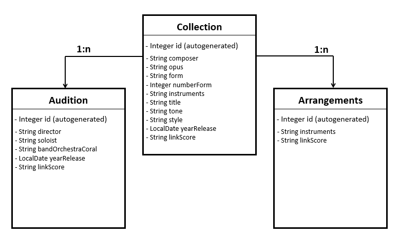

# Music-Library:1.0.0

---

## Description of the project

This project presents a fully functional CRUD Spring Boot application developed in Java. The goal of the project is to create a music library, where models are 'Collection', 'Audition' and 'Arrangements'. The models are interrelated and form a coherent structure. The application allows users to read, create, update, and delete all the models present. Additionally, the project includes features such as searching collections for other ways (ByForm, ByStyle, ...). The application is robust and handles errors gracefully. Some methods of 'Collection' have been successfully tested.

## Class Diagram



## Setup
### Requirements
- java 17.0.12+
- Apache Maven 3.9.9+
- MySQL 8.0+ 

### 1.- Clone the Repository
- Clone the project repository to your local machine:

```sh
git clone https://github.com/Esteban-Gamboa-01/lab504.git
cd your-clone-repo
# If you aren't ubicating in the correct directory the following command lines aren't aplicated.
```

### 2.- Configure Database Credentials
- The project creates a database: project01. 
- In `src/main/resources/application.properties` and you have:

```properties
# If it had neccesary, change environment variables.
# MySQL connection URL
spring.datasource.url=${DB_URL}
# "jdbc:mysql://localhost:3306/project01?createDatabaseIfNotExist=true&serverTimezone=UTC"

# Database access credentials
spring.datasource.username=${DB_USER}
# "root"
spring.datasource.password=${DB_PASS}
#
```

### 3.- Create Spring Boot Image-Network-Volume
- Use the terminal:

```properties
# Build the Spring Boot Image
docker build -t project01:1.0.0 .

# Create a Network
docker network create project01-net

# Create a Volume
docker volume create project01-data
```

### 4.- Run the MySQL Container and Spring Boot Container
- Use the terminal:

```properties
# This command line downloads mysql:8.0 of Docker Hub.
docker run -d --name mydb-project01 --network project01-net -v project01-data:/var/lib/mysql -e MYSQL_ROOT_PASSWORD= -e MYSQL_DATABASE=project01 mysql:8.0

# Spring Boot Container is generated with this line command.
docker run -d --name musicApp --network project01-net -p 8080:8080 project01:1.0.0
```

### 5.- Run the Project in a Browser or Postman
- The Spring Boot application should start and be available at http://localhost:8080.

---

## Technologies Used
- `Java 17` - Programming language used for application development.


- `Spring Boot 3.3.9` - Framework for creating microservices-based Java applications.


- `Spring Data JPA` - A library that facilitates access to databases using JPA and makes working with repositories easier.


- `Spring Web` - Framework for creating web applications and RESTful APIs.


- `MySQL 8.0.40` - Relational database used to store information.


- `Hibernate` - An open-source ORM framework used for entity management and communication with the database.


- `Maven` - A build automation tool used primarily for Java projects.


- `Lombok` - A Java library used to reduce boilerplate code such as getters, setters, constructors.


- `JUnit 5` - A framework used for writing and running tests in Java.


- `MockMvc` - It's a tool provided by Spring Boot Test that allows you to test REST controllers without having to start a real server.

## Controllers and Routes structure


| Controllers           | Routes                              |
|-----------------------|-------------------------------------|
| CollectionController  | GET /collections                    |
|                       | GET /collections/{id}               |
|                       | GET /collections/composer           |      
|                       | GET /collections/form               |
|                       | GET /collections/style              |
|                       | POST /collections                   |
|                       | PUT /collections/{id}               |
|                       | DELETE /collections/{id}            |
| AuditionController    | GET /auditions                      |
|                       | GET /auditions/{id}                 |
|                       | GET /auditions/collection/{id}      |
|                       | POST /auditions                     |
|                       | PUT /auditions/{id}                 |
|                       | DELETE /auditions/{id}              |
| ArrangementsController| GET /arrangements                   |
|                       | GET /arrangements/collection/{id}   |
|                       | GET /arrangements/{id}              |
|                       | POST /arrangements                  |
|                       | PUT /arrangements/{id}              |
|                       | DELETE /arrangements/{id}           |
|                       | DELETE /arrangements/collection/{id}|

## Link to the Presentation

https://docs.google.com/presentation/d/1UEyC9_TqIQ7yGM7ynj81DAxWO0WjNUPE9_qWjV_0-6M/edit#slide=id.g3424bd29a72_0_0

## Future Work

This project is scalable to create a API for working among teachers and students at the music school.
- v1.0.1 &rarr Adding @Valid and modified some methods.
- v1.1.0 &rarr Adding new variable 'keywords' for getting a search more realist. 
- v1.2.0 &rarr Adding herence to 'Collection'.
- v2.0.0 &rarr Creating the frontend.
- v2.1.0 &rarr Adding security: root-user. Two environments: teacher-students.
- v2.2.0 &rarr Uploading .pdf to the API.
- v2.3.0 &rarr Adding method for sending homework.

## Team Members

This project was developed by:

[@Esteban-Gamboa-01](https://github.com/Esteban-Gamboa-01)